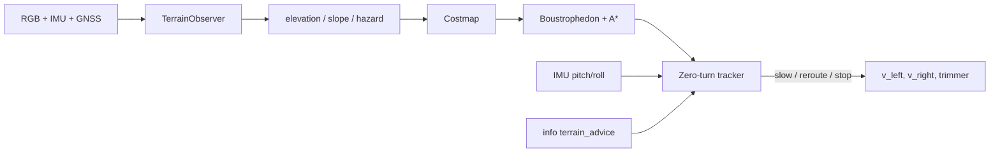
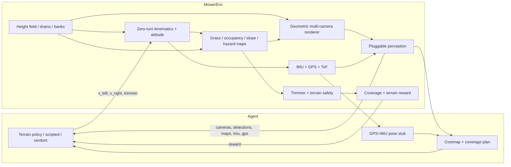

# jims-mower

Gymnasium environment for a **camera-driven zero-turn string-trimmer mower**.

The robot is a ~50×50×50 cm body with differential-drive wheels and a
**front-mounted whipper-snipper** (not under-deck blades). Perception is 4–6
RGB cameras with poses in YAML, plus a simulated **IMU**, **GNSS**, and
optional downward **ToF** array. v1 uses a lightweight geometric renderer and
**pluggable detectors / terrain observers** — mock and oracle in sim, working
stubs you can replace on a Jetson Orin Nano. There are no claimed mAP / FPS
numbers here.

The yard is **not flat**. Default yards carry a mild **whole-property
gradient** (planar slope plus optional undulation). Configurable **steep
banks** and **small earth drains** (shallow open drains / swales / drainage
ditches) are carved on top of that base. The mower must not drop a wheel
into a channel or tip on a bank.

## Quickstart

```bash
git clone https://github.com/jtwolfe/jims-mower.git
cd jims-mower
python -m pip install -e ".[dev]"

# Terrain-aware coverage (default). Heuristic CV maps, not god-view.
# Writes PNG frames, observer maps, and a plan overlay.
# Default --steps is 160 so the World Viewer has a real trail to scrub.
# Camera folders are dumped every 10 steps (--cam-stride); poses.json is every step.
jims-mower-demo --out demo_out
jims-mower-demo --steps 160 --cam-stride 10 --out demo_out

# Same path, explicit observer (YAML default is already heuristic):
python -m jims_mower.demo --terrain-observer heuristic --out demo_cv

# God-view maps for training / eval only:
python -m jims_mower.demo --terrain-observer oracle --out demo_oracle

# Steeper yard (stronger property grade + more drains / banks):
python -m jims_mower.demo --config configs/steep_yard.yaml --out demo_steep

# Whole-yard slope with a drain crossing the grade:
python -m jims_mower.demo --config gradient_yard --out demo_gradient

# Uneven golf snip (cart path + bunker + shed):
python -m jims_mower.demo --config golf_rough --out demo_golf

# One-acre explore/mow yard (70×58 m @ 0.50 m). Smoke only — not a
# coverage benchmark. Mesh: --stride 3 or 4.
python -m jims_mower.demo --config acre_yard --steps 80 --out demo_acre
jims-mower-mission-demo --config acre_yard --out mission_acre
jims-mower-mesh --out acre.glb --config acre_yard --seed 3 --stride 4

# Full mission: guided perimeter → explore/map → review → global mow
# Default --steps is 6000. --fast uses mission_tiny for CI smoke.
jims-mower-mission-demo --config golf_rough --out mission_out
jims-mower-mission-demo --fast --out mission_fast
jims-mower-viewer --episode mission_out

# Live owner session (observed terrain + fog, wall-clock). One command.
# Open http://127.0.0.1:8765/ while it runs — do not wait for the folder.
# acre_yard_demo is the Jamie live command: same ~1 acre features, short
# calibrate confirmation, demo map-ready at 42% observed, then MOW.
# Open idle → Start. Speed 1× 2× 5× max. MAP READY waits 2s or Start mow.
jims-mower-live --config acre_yard_demo --speed 5
jims-mower-live --config acre_yard --speed 5
jims-mower-live --fast --speed max --steps 40 --prepare-only --out live_tiny
# CI / laptop smoke uses --fast (mission_tiny). Full acre mow is manual.

# Keep the old scripted creep or random wheels:
python -m jims_mower.demo --policy scripted --out demo_scripted
python -m jims_mower.demo --policy random --out demo_random

# Behaviour cloning stub (loads bc_weights.npz if you trained one):
jims-mower-bc collect --steps 40 --cameras 4 --out bc_logs
jims-mower-bc train --in bc_logs --out bc_weights.npz
jims-mower-demo --policy bc --bc-weights bc_weights.npz --out demo_bc

# Record / replay (offline planner, or replay actions through the env)
jims-mower-record --out /tmp/jm-ep --steps 20 --cameras 4
jims-mower-replay /tmp/jm-ep --mode offline
jims-mower-replay /tmp/jm-ep --mode env

# Or:
python -m jims_mower.demo --cameras 6 --hand-signals --out demo_out

# WAVE 1A — scenario yard, dataset dump, farm dry-run (BEV is in demo_out)
python -m jims_mower.demo --config suburban --steps 160 --out demo_out
python -m jims_mower.export --steps 8 --seed 7 --cameras 4 --out dataset_out
python -m jims_mower.farm --dry-run --out farm_out

# WAVE 2A — geofence + movers, hand-signal policy, mission resume
python -m jims_mower.demo --config geofence_movers --steps 16 --out demo_fence
python -m jims_mower.demo --hand-signals --steps 12 --out demo_signals
python -m jims_mower.demo --steps 16 --save-mission /tmp/mission.npz --out demo_save
jims-mower-mission resume --in /tmp/mission.npz --steps 8 --out demo_resume

# WAVE 4 — sequence, curriculum, survey import, extra study axes
jims-mower-sequence --yards paddock,suburban --dry-run --out seq_out
jims-mower-curriculum
jims-mower-import-yard configs/surveys/example_yard.json
jims-mower-study --kind pitch --dry-run --out study_pitch
python -m jims_mower.demo --config narrow_gate --steps 12 --out demo_gate

# WAVE UX-A — World Viewer + teach a geofence (no mAP / FPS)
jims-mower-demo --steps 160 --out demo_out
jims-mower-viewer --episode demo_out
jims-mower-teach --steps 80 --out teach_out
jims-mower-demo --profile teach_out/profile.json --out demo_taught
jims-mower-live --fast --speed max --steps 40 --prepare-only --out live_tiny

# WAVE UX-B — software self-test (no RF hardware)
jims-mower-selftest

# WAVE UX-C — local owner app (API + phone UI; reuses UX-A viewer/mesh)
jims-mower-app --backend memory --yard configs/yards/example_profile.json --port 8765
# open http://127.0.0.1:8765/  (sim: omit --backend memory; episode: --episode DIR)
```

Docs: [`docs/UX.md`](docs/UX.md), [`docs/UX_B.md`](docs/UX_B.md), [`docs/UX_C.md`](docs/UX_C.md).

Contracts and the no-hardware backlog: [`ICD.md`](ICD.md), [`ROADMAP.md`](ROADMAP.md).

```python
import gymnasium as gym
import jims_mower  # registers jims_mower/Mower-v0

env = gym.make("jims_mower/Mower-v0")
obs, info = env.reset(seed=0)
# obs["cameras"]["front"] → uint8 RGB (H, W, 3)
# obs["imu"] → [ax, ay, az, gx, gy, gz]  (body z-up; level rest ≈ [0,0,9.81])
# obs["gps"] → [x, y, z, valid]
# obs["elevation"], obs["slope"], obs["hazard"] → yard rasters
# action: [left_wheel, right_wheel, trimmer_request] in [-1,1] × [-1,1] × [0,1]
obs, reward, terminated, truncated, info = env.step(env.action_space.sample())
env.close()
```

Headless CI runs `pytest` (no display). The same path works on a laptop.

## Hardware the gym is modeling

| Piece | Constraint |
| --- | --- |
| Body | ~0.50 × 0.50 × 0.50 m |
| Drive | Zero-turn differential drive (no holonomic strafe) |
| Cutter | Front-mounted string trimmer, safety interlock near people/animals |
| Compute | Jetson Orin Nano class — keep the observation contract light |
| Cameras | 4–6 RGB, default rig in `configs/default.yaml` |
| IMU | 6-axis accel + gyro (noisy, gravity-consistent) |
| GNSS | Horizontal fix + optional altitude, configurable dropout |
| ToF | Four downward ranges at the wheel corners (drain-lip stub) |

### Recommended hardware bill (Orin Nano class)

These are **class recommendations**, not a shopping cart with fake benchmarks.

| Role | Class to buy | Why |
| --- | --- | --- |
| Compute | Jetson Orin Nano 8 GB, JetPack 6 | Fits the camera + IMU fusion stubs; do not put a desktop OpenCV GUI on-box |
| IMU | BMI088 or ICM-42688-P class 6-axis (I2C/SPI) | Tip-over and pitch/roll; gyro for yaw rate. Optional LIS3MDL magnetometer later |
| GNSS | u-blox M10 / NEO-M9N class UART module | Yard-scale absolute XY. RTK is optional later, not required for the gym contract |
| RGB cameras | Existing 4–6 CSI/USB; front pair pitched ~20° down | Drain lips live in the lower third of the image |
| Close-range height | 4× VL53L1X (or similar) ToF under the chassis, or a cheap downward stereo pair | Wheel-drop / swale lip. The gym `tof` obs is this stub |
| Mounting | IMU near the geometric center, GNSS on the roof with sky view | Keep camera-IMU extrinsics in YAML once you measure them |

**Do not** drop a full VIO/SLAM stack into this repo. On the robot, run your
own fusion behind `TerrainObserver` (and a real `Detector`). The gym ships
`HeuristicTerrainObserver` (RGB colour + ground-plane back-projection + ToF
+ IMU; demo default), `LearnedTerrainObserver` (exporter-trained numpy
colour+position stub), `OracleTerrainObserver` for training, and
`BlindTerrainObserver` as the empty swap-in for a real segmentation / depth
net. There are no claimed mAP / FPS numbers here.

## Terrain and recommended behaviour

The height field is a raster aligned with the grass map.

- **Banks** — raised berms, slope capped by `world.terrain.max_slope_rad`.
- **Earth drains** — narrow channels with a depth and side slope (V / swale
  profile). Labels: channel (`2`) and lip (`3`).
- **Robot attitude** — after the usual 2D zero-turn integrate, the pose sits
  on the field: `z` is mean contact height, `pitch` / `roll` from front–rear
  and left–right wheel heights. The trimmer hub follows local ground height.
- **Hazards** — a wheel in the channel (`drain_drop`) or pitch/roll past
  `tip_*_rad` **terminates** the episode. High slope is a per-step penalty
  (`reward.steep`) and `info["terrain_advice"] == "slow"`.

Policy should treat `info["terrain_advice"]` as:

| Advice | Meaning |
| --- | --- |
| `ok` | Continue coverage |
| `slow` | High slope under the chassis — cut wheel speeds |
| `reroute` | Drain lip under a wheel or ahead — do not straddle; go around |
| `stop` | Tip-over risk or a wheel already in the channel |

Maps in the observation (`elevation`, `slope`, `hazard`) come from the
pluggable terrain observer. The demo default is the **heuristic CV**
observer — not the god-view field. Physics and reward always use the
**true** height field.

The default demo policy (`--policy terrain`) **accounts for** those maps: it
builds a costmap, plans a coverage path around channels / bank lips, and the
controller slows, reroutes, or stops instead of applying scripted wheel
speeds. When the heuristic map grows new lips, the planner replans.

That policy still plans from the **current** observer raster, so a 160-step
clip only covers a few metres. For a visual yard job use
`jims-mower-live` (wall-clock + growing observed terrain + fog) or
`jims-mower-mission-demo` (writes a finished episode, then scrub it):
calibrate the keep-in, explore unknown space, freeze the map, then mow
every reachable mowable cell. Unknown cells are not assumed safe. The
owner mesh is the **observed** elevation surface (holes stay fog);
physics still uses the true height field. See
[`docs/MISSION_FLOW.md`](docs/MISSION_FLOW.md).

## From detection to a wheel command



1. **Detect / estimate** — `TerrainObserver` fills `elevation`, `slope`, and
   `hazard` (`0` free, `1` steep, `2` drain lip, `3` channel). Demo default
   is the RGB+ToF heuristic (colour/geometry cues from the renderer’s ditch
   shading, multi-camera BEV fuse onto a ground plane). `learned` loads a
   numpy stub trained on exporter labels. Oracle is training-only.
   On the robot, replace the classifier + back-project with your
   segmentation / depth head.
2. **Costmap** — free = 1; steep below `planner.max_climb_slope_rad` = slow
   corridor; steeper than that, drain lips, and channels are blocked. Channels
   and lips are inflated by `planner.drain_clearance_m`. Occupancy (trees /
   detections) is blocked too. Per-cell `confidence` inflates finite costs
   when the observer is unsure (`planner.uncertainty`).
3. **Plan** — lawnmower strips on free grass, A* between strip ends so the
   path goes *around* a ditch instead of across it.
4. **Act** — a differential-drive tracker follows waypoints. `terrain_advice`
   and an IMU pitch/roll cross-check map to behaviour: **slow** scales cruise
   by `planner.slow_speed_factor`, **reroute** blocks a forward cone and
   replans, **stop** zeros the wheels (the env still terminates on tip-over or
   a wheel in the channel).
5. **Pose filter** — `EkfPoseFilter` (default) fuses GPS XY (+ optional Z),
   IMU tilt/rates, and wheel odometry. Configurable process/measurement
   noise under `planner.ekf`. `ComplementaryPoseFilter` remains as the
   onboard stub (`planner.pose_filter: complementary`). The planner uses
   the fused estimate as its start pose.

On a **Jetson Orin Nano** this same split is the runtime: GStreamer/NVMM
cameras + your detector / terrain head behind the protocols, the numpy
costmap + planner + controller in-process (the rasters are small), and the
EKF (or the complementary stub) behind `TerrainPolicy.fusion`. Do not run the
gym renderer or `OracleTerrainObserver` on-box. Tune `max_climb_slope_rad`,
`drain_clearance_m`, `slow_speed_factor`, and `planner.uncertainty` in YAML
to the machine and the yard.

## Architecture



- **Kinematics** — closed-form differential drive, then `sit_on_terrain`.
  Equal-and-opposite wheel speeds are a true zero-radius pivot.
- **Maps** — grass coverage is stamped by the trimmer when the interlock
  allows it. Drain channels are non-grass. Occupancy is filled from
  detections (the CV hook), not a god-view. Slope / hazard / elevation are
  the terrain observer.
- **Renderer** — numpy-only pinhole views. Rays iterate against the height
  field; ground is shaded by slope (Lambert) and drain/bank labels so a CV
  hook can tell a ditch from flat grass. No OpenGL, no GUI.
- **Perception** — `Detector` / `GrassObserver` / `TerrainObserver`
  protocols. Sim default is `MockDetector` plus `HeuristicTerrainObserver`
  (RGB drain/bank cues + ToF + IMU, multi-camera BEV fuse).
  `LearnedTerrainObserver` loads exporter-trained numpy weights.
  `OracleTerrainObserver` is the training god-view. `BlindDetector` /
  `BlindTerrainObserver` are working empty stubs.
- **Hand signals** — optional curriculum labels `stop`, `go`, `follow`,
  `back` on people. Off by default.

## Observation and action

**Action** (`Box(3,)`):

0. Left wheel speed, fraction of `max_wheel_speed_mps`
1. Right wheel speed
2. Trimmer request (`> 0.5` means “on”; the interlock can still refuse)

**Observation** (Dict):

| Key | Meaning |
| --- | --- |
| `cameras` | Dict of uint8 RGB frames, one per configured camera |
| `coverage` | Grass map: `1` cut, `0` uncut, `-1` non-grass |
| `occupancy` | Occupancy rasterized from detections |
| `elevation` | Height-field estimate (metres) — heuristic recovers a yard-scale plane |
| `elevation_prior` | Low-frequency planar grade from IMU + pose |
| `slope` | Slope raster (radians, 0–π/2) |
| `hazard` | `0` free, `1` steep, `2` drain lip, `3` drain channel |
| `structure` | `0` none, `1` path_paved, `2` building, `3` bunker, `4` garden_bed, `5` green |
| `confidence` | Per-cell map confidence in `[0, 1]` |
| `detections` | Padded `[label, cam, u, v, w, h, conf, signal]` |
| `pose` | `(x, y, theta, z, pitch, roll)` |
| `imu` | `(ax, ay, az, gx, gy, gz)` body frame |
| `gps` | `(x, y, z, valid)` — `valid` is 0 on dropout |
| `tof` | Downward ranges at FL, FR, RL, RR |
| `trimmer_enabled` | `0` or `1` after the interlock |
| `hand_signal` | `0` none, `1` stop, `2` go, `3` follow, `4` back |

Structured detections also live in `info["detections"]`. Reward is **new grass
cut** minus a small time penalty, with large penalties for hitting a person /
animal / static object, leaving the yard, **tipping**, or **dropping a wheel
into a drain**, plus a per-step steep-slope cost and a completion bonus.

## Config

Edit `configs/default.yaml` or pass a dict / path into `MowerEnv(config=...)`.
`configs/steep_yard.yaml` is a louder drain/bank scenario with a stronger
property-scale grade. `configs/scenarios/gradient_yard.yaml` is a clear
whole-yard slope plus one drain that crosses it.

Terrain generation (`world.terrain`):

| Key | Role |
| --- | --- |
| `base_gradient.slope_rad` | Planar grade (rad). Alias: `slope_pct` (percent). Default ~0.05 (~5%) |
| `base_gradient.yaw_rad` | Direction of *ascent* (elevation increases along this heading) |
| `base_gradient.undulation_m` | Gentle sine roll + weak quadratic dish (metres) |
| `n_drains` / `n_banks` | Feature counts (kept off the robot spawn) |
| `drain_width_m` / `drain_depth_m` / `drain_length_m` | Channel geometry |
| `drain_side_slope` | Rise/run of the ditch sides |
| `bank_height_m` / `bank_width_m` / `bank_length_m` | Berm geometry |
| `max_slope_rad` | Cap on generated bank faces |
| `noise_amp_m` | Low-amplitude grass rumble |

The base gradient is applied first and centered on the yard. Drains and
banks carve on top of that tilted surface. The curriculum `flat` scenario
zeros the gradient. `steep_yard` uses a stronger grade (~0.10 rad).
`golf_rough` / `golf_fairway_snip` add multi-scale undulation plus authored
cart paths, bunkers, and buildings. `acre_yard` is a ~1-acre (70×58 m @
0.50 m, ~16.2k cells) suburban/rural block with trees, bush beds, sand
bowls, paths, sheds, a pond keep-out, and uneven ground. See
[`docs/TERRAIN_MAPS.md`](docs/TERRAIN_MAPS.md).

`world.terrain.dem_path` is an optional vendored `.npy` height patch
(resampled, mean-centered). CI does not download ELVIS / OpenTopography /
SRTM. A 32×32 synthetic fixture ships as `bundled_dem_path()`.

Sensor noise (`sensors.imu` / `sensors.gps` / `sensors.tof`): white noise
stds, IMU accel bias (drawn once per episode), GPS dropout probability.

`perception.terrain_mode`: `heuristic` (demo default), `oracle` (training
god-view), `learned` (numpy stub + `perception.weights_path`), or `blind`
(empty stub). Override from the CLI with `--terrain-observer`.

Train the stub from an export (CPU, no torch):

```bash
python -m jims_mower.export --steps 8 --seed 7 --cameras 4 --out dataset_out
python scripts/train_terrain_seg.py --dataset dataset_out --out terrain_mlp.npz
# Domain-rand training dump (lighting / dirt / vignette). See docs/WAVE2B.md.
python -m jims_mower.export --steps 8 --seed 7 --cameras 4 --domain-rand --out dataset_dr
```

Coverage planner (`planner`):

| Key | Role |
| --- | --- |
| `max_climb_slope_rad` | Above this, steep cells are blocked (below: slow corridor) |
| `drain_clearance_m` | Inflation around channels / lips |
| `slow_speed_factor` | Wheel-speed scale when advice is `slow` |
| `strip_spacing_m` | Boustrophedon lane width |
| `cruise_speed` | Nominal forward command in \([-1, 1]\) |
| `blend_elevation_prior` | Floor observer slope with the IMU plane (default on) |
| `path_cost` / `bunker_cost` | Traversal cost for paved ribbons / sand bowls |

Default 6-camera body-frame rig (x forward, y left, z up). Front cameras are
pitched a bit more down than v0 so drain lips sit in frame:

| Name | Position (m) | Yaw | Pitch |
| --- | --- | --- | --- |
| `front` | (0.25, 0.00, 0.38) | 0° | −22° |
| `front_left` | (0.20, 0.20, 0.38) | +40° | −18° |
| `front_right` | (0.20, −0.20, 0.38) | −40° | −18° |
| `rear` | (−0.25, 0.00, 0.38) | 180° | −12° |
| `left` | (0.00, 0.25, 0.38) | +90° | −12° |
| `right` | (0.00, −0.25, 0.38) | −90° | −12° |

`sensors.camera_count: 4` or `5` drops to the cardinal subset (plus `front_left`
for 5). You can also list explicit camera poses in YAML.

Swap perception:

```python
from jims_mower.env import MowerEnv
from jims_mower.perception import BlindDetector, BlindTerrainObserver, LearnedTerrainObserver

env = MowerEnv(
    detector=BlindDetector(),
    terrain_observer=BlindTerrainObserver(),
    hand_signals=True,
)
# After scripts/train_terrain_seg.py:
# env = MowerEnv(terrain_observer=LearnedTerrainObserver("terrain_mlp.npz"))
```

A real onboard detector should implement `detect(images, context) -> list[Detection]`
and ignore `context.obstacles` (that field is sim-only). A real terrain head
should implement `estimate(images, imu, gps, context) -> TerrainEstimate` and
ignore `context.terrain` (also sim-only).

## Camera → terrain maps → planner on an Orin Nano

The gym already uses the same split you want on the robot. Swap the *heads*,
keep the numpy maps and planner.

```
CSI / USB RGB  ─┐
                ├─► TerrainObserver.estimate(images, imu, gps, ctx)
downward ToF  ─┤         │
IMU + GNSS    ─┘         ▼
                  elevation / slope / hazard   (yard rasters)
                             │
                             ▼
                  Costmap → boustrophedon + A* → zero-turn tracker
```

| Gym piece | On the Orin, replace with |
| --- | --- |
| `classify_terrain_rgb` (brown / olive palette) | A segmentation head (drain / lip / bank / grass). TensorRT INT8 is the usual path. Do **not** ship the palette heuristic as the production detector. |
| `ground_hits` flat-plane back-projection | Camera extrinsics in YAML + a depth net, stereo, or ToF cloud. Same output: world XY cells to stamp. |
| `stamp_tof_corners` | Real VL53L1X (or similar) ranges at the wheel corners. Same hook. |
| IMU slope disk | Keep; fuse with `EkfPoseFilter` (or the complementary stub). |
| `OracleTerrainObserver` | Training / eval only. Never run on-box. |
| `BlindTerrainObserver` | Empty stub while you wire the net. Same `estimate(...)` contract. |
| `LearnedTerrainObserver` | Sim-only numpy stub trained on exporter labels. Not a production head. |
| Costmap + planner + controller | Keep in-process. The rasters are small. |

`HeuristicTerrainObserver` is a **working sim stand-in**: it is good enough
that the coverage planner still goes around drains on `steep_yard` for the
fixed seeds in `tests/test_heuristic_planner.py`. It is not a published
detector. There are no mAP / FPS numbers here.

## Jetson Orin Nano notes

This package is the **training / eval gym**, not the robot runtime.

- Target board: Orin Nano 8 GB, ARM64, JetPack 6. Keep camera tensors small
  (default 80×60 in sim; downsample real cameras to the same contract).
- Do not pull a desktop OpenCV GUI or a full detector / SLAM stack into this
  repo. On the robot, run GStreamer/NVMM capture + your TensorRT (or similar)
  head behind the `Detector` / `TerrainObserver` protocols.
- Fuse IMU + GNSS + wheel odometry with the shipped `EkfPoseFilter`, or
  keep `ComplementaryPoseFilter` as the lighter stub. The gym still emits
  the noisy measurements. See `docs/runtime_contract.md` and `docs/WAVE1B.md`.
- The numpy renderer is for the gym only. It will not run as the robot’s
  perception.
- Memory budget on-device is the model, not this env. The heuristic / mock
  path is for laptops and CI; oracle is for training loops.
- Enable `hand_signals` only when you are actually labeling or synthesizing
  that curriculum — it is optional.

See [`docs/JETSON.md`](docs/JETSON.md) and
[`docker/Dockerfile.aarch64`](docker/Dockerfile.aarch64) for WAVE 3B
packaging notes. Fake I2C / UART / CSI drivers and a stdlib
multiprocessing bridge live in `jims_mower.runtime`. Do **not** invent
onboard FPS. `jims-mower-export-trt --dry-run` is a TensorRT command
placeholder (`fps_claim: null`).

## Tests

```bash
pytest
```

Unit tests cover kinematics (including zero-turn and slope attitude), drain
and tip-over hazards, IMU/GPS observation shapes, the trimmer interlock,
maps, camera math, the mock detector, RGB terrain classification and
back-projection, terrain observers (oracle / heuristic / learned / blind),
BEV fuse, hazard hysteresis, person/dog tracklets, the uncertainty-aware
costmap and coverage planner (channels forbidden), the controller (slows
on steep / stops on tip / replans when the vision map grows), the EKF pose
filter (observability sanity) plus the complementary stub, the runtime
contract, record/replay roundtrip, the latency scorecard (no FPS claims),
reward, the renderer’s non-flat shading and plan overlay, the Gymnasium
env checker, heuristic+planner episodes on `steep_yard` (fixed seeds: no
channel entry; coverage vs oracle is reported without a fake mAP), the
scenario loader, dataset-export layout, scorecards on frozen seeds, a farm
dry-run, moving-agent trajectories, geofence costmaps, recovery /
hand-signal overrides, mission save/load, the ESTOP/limp machine, BC
collect/train, the numpy RL smoke, incident/telemetry dumps, the owner
overlay stub, fake-driver bridge replay, design-study dry-run, and the
TensorRT placeholder. GitHub Actions PR CI runs the same suite headless
on Python 3.10–3.12 plus short terrain-policy, suburban, geofence,
mission, record/replay, BC collect/train, numpy RL smoke, incident
viewer, telemetry, owner overlay, bridge-replay, design-study dry-run,
and TensorRT-placeholder smokes (heuristic default). Torch and SB3 are
optional extras and are not installed in CI. The full seed×scenario
farm is a separate
[manual / nightly workflow](.github/workflows/farm.yml), not PR CI.
Design-study **live** sweeps (`jims-mower-study` without `--dry-run`)
are laptop / overnight jobs.

## WAVE 1A foundation

| Piece | Module / path |
| --- | --- |
| Scenario DSL | [`src/jims_mower/scenarios.py`](src/jims_mower/scenarios.py), [`configs/scenarios/`](configs/scenarios/) |
| Dataset exporter | `python -m jims_mower.export` — PNG + JSON sidecars, `coco.json` |
| Scorecards | [`src/jims_mower/metrics.py`](src/jims_mower/metrics.py) |
| Overnight farm | `python -m jims_mower.farm` (exit 1 if tip/drain gates fail) |
| BEV debugger | [`src/jims_mower/bev.py`](src/jims_mower/bev.py) → `bev_final.png` |
| ICD / roadmap | [`ICD.md`](ICD.md), [`ROADMAP.md`](ROADMAP.md) |
| WAVE 2B train stub | [`docs/WAVE2B.md`](docs/WAVE2B.md), `scripts/train_terrain_seg.py` |

Exporter labels are **oracle** height-field / grass rasters. The env
observer can still be heuristic. Dataset folder layout is written to
`LAYOUT.md` in the dump.

## WAVE 2A — dynamic world + behaviour

| Piece | Module / path |
| --- | --- |
| Trajectories | `Obstacle.trajectory` (`patrol` / `loop` / `line` / `wander`) |
| Living interlock | `info["living_advice"]` — slow / reroute / stop; occupancy replans |
| Geofence | scenario `keep_in` / `keep_out`; costmap blocks outside |
| Recovery | reverse → pivot → help after repeated tip / channel advice |
| Hand signals | curriculum on → controller overrides (`stop`/`go`/`follow`/`back`) |
| Mission resume | `jims-mower-mission` + `--save-mission` / `--load-mission` |

The planner still runs in-process on small numpy rasters (Orin Nano class).
There are no claimed mAP / FPS numbers. Do not run the gym renderer on-box.

## WAVE 3A — learning + ops tooling

| Piece | Module / path |
| --- | --- |
| Behaviour cloning | `jims-mower-bc collect\|train`; `--policy bc` |
| RL scaffold | `jims-mower-rl` (numpy); optional `pip install -e ".[rl]"` for SB3 |
| Action mask | [`action_mask.py`](src/jims_mower/action_mask.py) — hazard cone |
| ESTOP / limp / safe | [`safe_state.py`](src/jims_mower/safe_state.py) used by `TerrainPolicy` |
| Incident viewer | `jims-mower-incident <episode> --out viewer/` |
| Telemetry JSON | `jims-mower-telemetry` — coverage, tip rate, drains, living near-misses |
| Owner overlay | `jims-mower-owner --config geofence_movers` |

The BC/RL stubs are **baselines**, not claimed SOTA. Train MSE / episode
return in logs are diagnostic only. torch and stable-baselines3 stay out
of the default install and out of PR CI.

## WAVE 3B — runtime stubs / Orin notes / studies

| Piece | Module / path |
| --- | --- |
| Fake drivers | `jims_mower.runtime.drivers` — I2C IMU, UART GNSS, CSI cams, I2C ToF |
| Bridge | `jims-mower-bridge` — stdlib multiprocessing, no ZMQ / gRPC |
| ROS 2 stubs | `jims_mower.runtime.ros2_stubs` — `[ros2]` marker extra; no `rclpy` in CI |
| Studies | `jims-mower-study` — camera 4/5/6, ToF 0/2/4, IMU×; tip / drain-entry rates |
| Budget | `OrinBudget` — limp / stop when `runtime.enabled` and hot or low SOC |
| Jetson notes | [`docs/JETSON.md`](docs/JETSON.md), [`docs/WAVE3B.md`](docs/WAVE3B.md) |

```bash
jims-mower-study --dry-run --out study_out
jims-mower-record --out /tmp/ep --steps 8 --cameras 4
jims-mower-bridge /tmp/ep
jims-mower-export-trt --dry-run
```

## WAVE UX-B — faults + radio sim

| Piece | Module / path |
| --- | --- |
| FaultBus | [`faults.py`](src/jims_mower/faults.py) — motors, trimmer, cam, IMU, GNSS |
| Immobilised vs stuck | Dead motor → `FAULT_IMMOBILISED` + SOS; terrain stuck still recovers |
| Radio sim | [`radio.py`](src/jims_mower/radio.py) — Wi-Fi → BT → LoRa, no RF hardware |
| Self-test | `jims-mower-selftest` — spin / IMU still / frame entropy |
| Notes | [`docs/UX_B.md`](docs/UX_B.md) |

```bash
jims-mower-selftest
```

## Layout

```
ROADMAP.md ICD.md
configs/default.yaml          camera poses + yard / terrain / sensors / planner
configs/steep_yard.yaml       louder drain / bank demo + stronger yard grade
configs/scenarios/            WAVE 1A/1C/2A yards (suburban, gradient_yard, …)
docs/                         WAVE notes + UX.md / UX_B.md + JETSON + runtime contract
docker/Dockerfile.aarch64     Orin / aarch64 packaging notes (not CI)
src/jims_mower/               env, kinematics, terrain, planning, sensors, safety
src/jims_mower/runtime/       fake drivers, bridge, budget, TRT placeholder
src/jims_mower/scenarios.py   YAML scenario loader
src/jims_mower/geofence.py    keep-in / keep-out polygons
src/jims_mower/mission.py     map + uncut + pose save/load
src/jims_mower/export.py      dataset dump
src/jims_mower/metrics.py     episode scorecards
src/jims_mower/farm.py        seed × scenario farm
src/jims_mower/bev.py         BEV composite
src/jims_mower/perception/    observers, BEV fuse, temporal filters, train stub
src/jims_mower/planning/      costmap, boustrophedon+A*, controller, EKF
src/jims_mower/contract.py    versioned message schemas
src/jims_mower/episode.py     record / replay
src/jims_mower/live.py        wall-clock mission + fog-of-war SSE session
src/jims_mower/viewer.py      World Viewer HTTP + live SSE
scripts/train_terrain_seg.py  export → numpy terrain weights
docs/WAVE2B.md                domain-rand training note
src/jims_mower/bc.py          numpy behaviour-cloning stub
src/jims_mower/rl.py          REINFORCE / random-search / optional SB3
src/jims_mower/safe_state.py  ESTOP / limp / safe
src/jims_mower/incident.py    episode scrubber
src/jims_mower/telemetry.py   ops JSON
src/jims_mower/owner.py       phone overlay HTML
tests/                        pytest
```

MIT licensed. See `LICENSE`.
