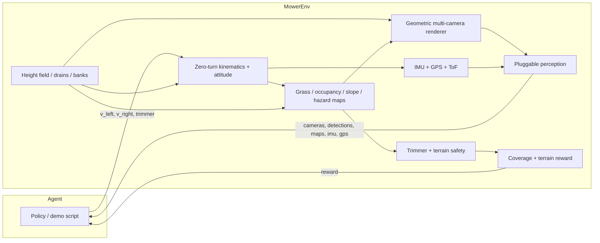

# jims-mower

Gymnasium environment for a **camera-driven zero-turn string-trimmer mower**.

The robot is a ~50×50×50 cm body with differential-drive wheels and a
**front-mounted whipper-snipper** (not under-deck blades). Perception is 4–6
RGB cameras with poses in YAML, plus a simulated **IMU**, **GNSS**, and
optional downward **ToF** array. v1 uses a lightweight geometric renderer and
**pluggable detectors / terrain observers** — mock and oracle in sim, working
stubs you can replace on a Jetson Orin Nano. There are no claimed mAP / FPS
numbers here.

The yard is **not flat**. Configurable **steep banks** and **small earth
drains** (shallow open drains / swales / drainage ditches) are first-class
world features. The mower must not drop a wheel into a channel or tip on a
bank.

## Quickstart

```bash
git clone https://github.com/jtwolfe/jims-mower.git
cd jims-mower
python -m pip install -e ".[dev]"

# Multi-camera demo (writes PNG frames + detections + terrain layers)
jims-mower-demo --steps 40 --out demo_out

# Steeper yard (more drains / banks):
python -m jims_mower.demo --config configs/steep_yard.yaml --out demo_steep

# Or:
python -m jims_mower.demo --cameras 6 --hand-signals --out demo_out
```

```python
import gymnasium as gym
import jims_mower  # registers jims_mower/Mower-v0

env = gym.make("jims_mower/Mower-v0")
obs, info = env.reset(seed=0)
# obs["cameras"]["front"] → uint8 RGB (H, W, 3)
# obs["imu"] → [ax, ay, az, gx, gy, gz]  (body z-up; level rest ≈ [0,0,9.81])
# obs["gps"] → [x, y, z, valid]
# obs["elevation"], obs["slope"], obs["hazard"] → yard rasters
# action: [left_wheel, right_wheel, trimmer_request] in [-1,1] × [-1,1] × [0,1]
obs, reward, terminated, truncated, info = env.step(env.action_space.sample())
env.close()
```

Headless CI runs `pytest` (no display). The same path works on a laptop.

## Hardware the gym is modeling

| Piece | Constraint |
| --- | --- |
| Body | ~0.50 × 0.50 × 0.50 m |
| Drive | Zero-turn differential drive (no holonomic strafe) |
| Cutter | Front-mounted string trimmer, safety interlock near people/animals |
| Compute | Jetson Orin Nano class — keep the observation contract light |
| Cameras | 4–6 RGB, default rig in `configs/default.yaml` |
| IMU | 6-axis accel + gyro (noisy, gravity-consistent) |
| GNSS | Horizontal fix + optional altitude, configurable dropout |
| ToF | Four downward ranges at the wheel corners (drain-lip stub) |

### Recommended hardware bill (Orin Nano class)

These are **class recommendations**, not a shopping cart with fake benchmarks.

| Role | Class to buy | Why |
| --- | --- | --- |
| Compute | Jetson Orin Nano 8 GB, JetPack 6 | Fits the camera + IMU fusion stubs; do not put a desktop OpenCV GUI on-box |
| IMU | BMI088 or ICM-42688-P class 6-axis (I2C/SPI) | Tip-over and pitch/roll; gyro for yaw rate. Optional LIS3MDL magnetometer later |
| GNSS | u-blox M10 / NEO-M9N class UART module | Yard-scale absolute XY. RTK is optional later, not required for the gym contract |
| RGB cameras | Existing 4–6 CSI/USB; front pair pitched ~20° down | Drain lips live in the lower third of the image |
| Close-range height | 4× VL53L1X (or similar) ToF under the chassis, or a cheap downward stereo pair | Wheel-drop / swale lip. The gym `tof` obs is this stub |
| Mounting | IMU near the geometric center, GNSS on the roof with sky view | Keep camera-IMU extrinsics in YAML once you measure them |

**Do not** drop a full VIO/SLAM stack into this repo. On the robot, run your
own fusion behind `TerrainObserver` (and a real `Detector`). The gym ships
`OracleTerrainObserver` for training, `HeuristicTerrainObserver` (IMU + local
blob + brown-pixel hint), and `BlindTerrainObserver`.

## Terrain and recommended behaviour

The height field is a raster aligned with the grass map.

- **Banks** — raised berms, slope capped by `world.terrain.max_slope_rad`.
- **Earth drains** — narrow channels with a depth and side slope (V / swale
  profile). Labels: channel (`2`) and lip (`3`).
- **Robot attitude** — after the usual 2D zero-turn integrate, the pose sits
  on the field: `z` is mean contact height, `pitch` / `roll` from front–rear
  and left–right wheel heights. The trimmer hub follows local ground height.
- **Hazards** — a wheel in the channel (`drain_drop`) or pitch/roll past
  `tip_*_rad` **terminates** the episode. High slope is a per-step penalty
  (`reward.steep`) and `info["terrain_advice"] == "slow"`.

Policy should treat `info["terrain_advice"]` as:

| Advice | Meaning |
| --- | --- |
| `ok` | Continue coverage |
| `slow` | High slope under the chassis — cut wheel speeds |
| `reroute` | Drain lip under a wheel or ahead — do not straddle; go around |
| `stop` | Tip-over risk or a wheel already in the channel |

Maps in the observation (`elevation`, `slope`, `hazard`) come from the
pluggable terrain observer. Physics and reward always use the **true** height
field.

## Architecture



- **Kinematics** — closed-form differential drive, then `sit_on_terrain`.
  Equal-and-opposite wheel speeds are a true zero-radius pivot.
- **Maps** — grass coverage is stamped by the trimmer when the interlock
  allows it. Drain channels are non-grass. Occupancy is filled from
  detections (the CV hook), not a god-view. Slope / hazard / elevation are
  the terrain observer.
- **Renderer** — numpy-only pinhole views. Rays iterate against the height
  field; ground is shaded by slope (Lambert) and drain/bank labels so a CV
  hook can tell a ditch from flat grass. No OpenGL, no GUI.
- **Perception** — `Detector` / `GrassObserver` / `TerrainObserver`
  protocols. Sim default is `MockDetector` plus `OracleTerrainObserver`.
  `BlindDetector` / `BlindTerrainObserver` are working empty stubs.
- **Hand signals** — optional curriculum labels `stop`, `go`, `follow`,
  `back` on people. Off by default.

## Observation and action

**Action** (`Box(3,)`):

0. Left wheel speed, fraction of `max_wheel_speed_mps`
1. Right wheel speed
2. Trimmer request (`> 0.5` means “on”; the interlock can still refuse)

**Observation** (Dict):

| Key | Meaning |
| --- | --- |
| `cameras` | Dict of uint8 RGB frames, one per configured camera |
| `coverage` | Grass map: `1` cut, `0` uncut, `-1` non-grass |
| `occupancy` | Occupancy rasterized from detections |
| `elevation` | Height-field estimate (metres) |
| `slope` | Slope raster (radians, 0–π/2) |
| `hazard` | `0` free, `1` steep, `2` drain lip, `3` drain channel |
| `detections` | Padded `[label, cam, u, v, w, h, conf, signal]` |
| `pose` | `(x, y, theta, z, pitch, roll)` |
| `imu` | `(ax, ay, az, gx, gy, gz)` body frame |
| `gps` | `(x, y, z, valid)` — `valid` is 0 on dropout |
| `tof` | Downward ranges at FL, FR, RL, RR |
| `trimmer_enabled` | `0` or `1` after the interlock |
| `hand_signal` | `0` none, `1` stop, `2` go, `3` follow, `4` back |

Structured detections also live in `info["detections"]`. Reward is **new grass
cut** minus a small time penalty, with large penalties for hitting a person /
animal / static object, leaving the yard, **tipping**, or **dropping a wheel
into a drain**, plus a per-step steep-slope cost and a completion bonus.

## Config

Edit `configs/default.yaml` or pass a dict / path into `MowerEnv(config=...)`.
`configs/steep_yard.yaml` is a louder drain/bank scenario.

Terrain generation (`world.terrain`):

| Key | Role |
| --- | --- |
| `n_drains` / `n_banks` | Feature counts (kept off the robot spawn) |
| `drain_width_m` / `drain_depth_m` / `drain_length_m` | Channel geometry |
| `drain_side_slope` | Rise/run of the ditch sides |
| `bank_height_m` / `bank_width_m` / `bank_length_m` | Berm geometry |
| `max_slope_rad` | Cap on generated bank faces |
| `noise_amp_m` | Low-amplitude grass rumble |

Sensor noise (`sensors.imu` / `sensors.gps` / `sensors.tof`): white noise
stds, IMU accel bias (drawn once per episode), GPS dropout probability.

`perception.terrain_mode`: `oracle` (training), `heuristic`, or `blind`.

Default 6-camera body-frame rig (x forward, y left, z up). Front cameras are
pitched a bit more down than v0 so drain lips sit in frame:

| Name | Position (m) | Yaw | Pitch |
| --- | --- | --- | --- |
| `front` | (0.25, 0.00, 0.38) | 0° | −22° |
| `front_left` | (0.20, 0.20, 0.38) | +40° | −18° |
| `front_right` | (0.20, −0.20, 0.38) | −40° | −18° |
| `rear` | (−0.25, 0.00, 0.38) | 180° | −12° |
| `left` | (0.00, 0.25, 0.38) | +90° | −12° |
| `right` | (0.00, −0.25, 0.38) | −90° | −12° |

`sensors.camera_count: 4` or `5` drops to the cardinal subset (plus `front_left`
for 5). You can also list explicit camera poses in YAML.

Swap perception:

```python
from jims_mower.env import MowerEnv
from jims_mower.perception import BlindDetector, BlindTerrainObserver

env = MowerEnv(
    detector=BlindDetector(),
    terrain_observer=BlindTerrainObserver(),
    hand_signals=True,
)
```

A real onboard detector should implement `detect(images, context) -> list[Detection]`
and ignore `context.obstacles` (that field is sim-only). A real terrain head
should implement `estimate(images, imu, gps, context) -> TerrainEstimate` and
ignore `context.terrain` (also sim-only).

## Jetson Orin Nano notes

This package is the **training / eval gym**, not the robot runtime.

- Target board: Orin Nano 8 GB, ARM64, JetPack 6. Keep camera tensors small
  (default 80×60 in sim; downsample real cameras to the same contract).
- Do not pull a desktop OpenCV GUI or a full detector / SLAM stack into this
  repo. On the robot, run GStreamer/NVMM capture + your TensorRT (or similar)
  head behind the `Detector` / `TerrainObserver` protocols.
- Fuse IMU + GNSS with a complementary filter or a small EKF in *your*
  runtime; the gym only emits the noisy measurements.
- The numpy renderer is for the gym only. It will not run as the robot’s
  perception.
- Memory budget on-device is the model, not this env. The mock / oracle path
  is for laptops and CI.
- Enable `hand_signals` only when you are actually labeling or synthesizing
  that curriculum — it is optional.

## Tests

```bash
pytest
```

Unit tests cover kinematics (including zero-turn and slope attitude), drain
and tip-over hazards, IMU/GPS observation shapes, the trimmer interlock,
maps, camera math, the mock detector, terrain observers, reward, the
renderer’s non-flat shading, and the Gymnasium env checker. GitHub Actions
runs the same suite headless on Python 3.10–3.12 plus a short demo smoke.

## Layout

```
configs/default.yaml     camera poses + yard / terrain / sensors / reward
configs/steep_yard.yaml  louder drain / bank demo
src/jims_mower/          env, kinematics, terrain, sensors, safety, renderer
tests/                   pytest
```

MIT licensed. See `LICENSE`.
