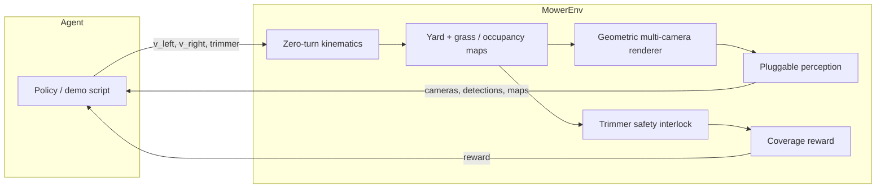

# jims-mower

Gymnasium environment for a **camera-driven zero-turn string-trimmer mower**.

The robot is a ~50×50×50 cm body with differential-drive wheels and a
**front-mounted whipper-snipper** (not under-deck blades). Perception is 4–6
RGB cameras with poses in YAML. v1 uses a lightweight geometric renderer and a
**pluggable detector** — mock detections in sim, working stubs you can replace
on a Jetson Orin Nano. There are no claimed mAP / FPS numbers here.

## Quickstart

```bash
git clone https://github.com/jtwolfe/jims-mower.git
cd jims-mower
python -m pip install -e ".[dev]"

# Multi-camera demo (writes PNG frames + detections JSON)
jims-mower-demo --steps 40 --out demo_out

# Or:
python -m jims_mower.demo --cameras 6 --hand-signals --out demo_out
```

```python
import gymnasium as gym
import jims_mower  # registers jims_mower/Mower-v0

env = gym.make("jims_mower/Mower-v0")
obs, info = env.reset(seed=0)
# obs["cameras"]["front"] → uint8 RGB (H, W, 3)
# action: [left_wheel, right_wheel, trimmer_request] in [-1,1] × [-1,1] × [0,1]
obs, reward, terminated, truncated, info = env.step(env.action_space.sample())
env.close()
```

Headless CI runs `pytest` (no display). The same path works on a laptop.

## Hardware the gym is modeling

| Piece | Constraint |
| --- | --- |
| Body | ~0.50 × 0.50 × 0.50 m |
| Drive | Zero-turn differential drive (no holonomic strafe) |
| Cutter | Front-mounted string trimmer, safety interlock near people/animals |
| Compute | Jetson Orin Nano class — keep the observation contract light |
| Cameras | 4–6 RGB, default rig in `configs/default.yaml` |

## Architecture



- **Kinematics** — closed-form differential drive. Equal-and-opposite wheel
  speeds are a true zero-radius pivot.
- **Maps** — grass coverage is stamped by the trimmer when the interlock
  allows it. Occupancy is filled from detections (the CV hook), not a god-view.
- **Renderer** — numpy-only pinhole views (ray-hit ground + projected blobs).
  No OpenGL, no GUI.
- **Perception** — `Detector` / `GrassObserver` protocols. Sim default is
  `MockDetector` (projects world objects into each camera) plus a green-channel
  grass heuristic. `BlindDetector` is a working empty stub.
- **Hand signals** — optional curriculum labels `stop`, `go`, `follow`,
  `back` on people. Off by default.

## Observation and action

**Action** (`Box(3,)`):

0. Left wheel speed, fraction of `max_wheel_speed_mps`
1. Right wheel speed
2. Trimmer request (`> 0.5` means “on”; the interlock can still refuse)

**Observation** (Dict):

| Key | Meaning |
| --- | --- |
| `cameras` | Dict of uint8 RGB frames, one per configured camera |
| `coverage` | Grass map: `1` cut, `0` uncut, `-1` non-grass |
| `occupancy` | Occupancy rasterized from detections |
| `detections` | Padded `[label, cam, u, v, w, h, conf, signal]` |
| `pose` | `(x, y, theta)` |
| `trimmer_enabled` | `0` or `1` after the interlock |
| `hand_signal` | `0` none, `1` stop, `2` go, `3` follow, `4` back |

Structured detections also live in `info["detections"]`. Reward is **new grass
cut** minus a small time penalty, with large penalties for hitting a person /
animal / static object or leaving the yard, plus a completion bonus.

## Config

Edit `configs/default.yaml` or pass a dict / path into `MowerEnv(config=...)`.

Default 6-camera body-frame rig (x forward, y left, z up):

| Name | Position (m) | Yaw | Pitch |
| --- | --- | --- | --- |
| `front` | (0.25, 0.00, 0.38) | 0° | −18° |
| `front_left` | (0.20, 0.20, 0.38) | +40° | −15° |
| `front_right` | (0.20, −0.20, 0.38) | −40° | −15° |
| `rear` | (−0.25, 0.00, 0.38) | 180° | −12° |
| `left` | (0.00, 0.25, 0.38) | +90° | −12° |
| `right` | (0.00, −0.25, 0.38) | −90° | −12° |

`sensors.camera_count: 4` or `5` drops to the cardinal subset (plus `front_left`
for 5). You can also list explicit camera poses in YAML.

Swap perception:

```python
from jims_mower.env import MowerEnv
from jims_mower.perception import BlindDetector

env = MowerEnv(detector=BlindDetector(), hand_signals=True)
```

A real onboard detector should implement `detect(images, context) -> list[Detection]`
and ignore `context.obstacles` (that field is sim-only).

## Jetson Orin Nano notes

This package is the **training / eval gym**, not the robot runtime.

- Target board: Orin Nano 8 GB, ARM64, JetPack 6. Keep camera tensors small
  (default 80×60 in sim; downsample real cameras to the same contract).
- Do not pull a desktop OpenCV GUI or a full detector stack into this repo.
  On the robot, run GStreamer/NVMM capture + your TensorRT (or similar) head
  behind the `Detector` protocol.
- The numpy renderer is for the gym only. It will not run as the robot’s
  perception.
- Memory budget on-device is the model, not this env. The mock path is for
  laptops and CI.
- Enable `hand_signals` only when you are actually labeling or synthesizing
  that curriculum — it is optional.

## Tests

```bash
pytest
```

Unit tests cover kinematics (including zero-turn), the trimmer interlock,
maps, camera math, the mock detector, reward, and the Gymnasium env checker.
GitHub Actions runs the same suite headless on Python 3.10–3.12 plus a short
demo smoke.

## Layout

```
configs/default.yaml     camera poses + yard / reward
src/jims_mower/          env, kinematics, safety, renderer, perception
tests/                   pytest
```

MIT licensed. See `LICENSE`.
